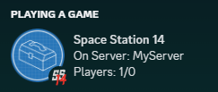

# Discord App Assets

So you want your server icon here, huh?

While RobustToolbox does not allow servers to select their own Discord app for Rich Presence purposes, Discord does allow us to upload 300 assets for it. This folder in the repo contains those assets. Servers may pull request an icon of their own that they want to be able to display, and we'll upload it.

## Requirements

* Your server/community must exist/be active for at least 15 days. Please don't waste our time for small servers that never really get off the ground and last for a week.
* Your server/community must not be [banned from the official server hub](https://docs.spacestation14.io/en/hosting/hub-rules). Note that you don't need to be *on* the hub (unlisted communities may get assets), you just need to not be forcibly removed from it.
* Only one asset per server, make it count!

## How to do it

Send a pull request that adds a file under `server-icons/`, next to the `placeholder.txt`. The name of your file should be the asset name in question (something clearly unambiguously your server, please). All latin characters/number/underscore/dash, thanks.

Your icon must follow Discord's requirements (1024x1024 recommended, 512x512 minimum, PNG or JPEG). I'm not going to upscale your icon for you, get it right yourself.

We'll merge the PR and subsequently update it in the Discord developer panel too.

## Why do it like this

* Allows server operators to request these icons in a public transparent manner.
* Doesn't rely on sending Discord DMs / emails and all that messyness.
* Great paper trail, especially for finding the original submitter for contact.
* Easy standard protocol.
* Minimizes time spent on my side because I already get to deal with enough project management duties.

## What about when it gets full?

Yeah I mean it's inevitable that we will run out of those 300 assets. I don't yet know what we'll do then, sorry 🤷.

Also I'm reserving 20 of those 300 for Robust/special cases. So you get 280 servers. That's a lot, right?
